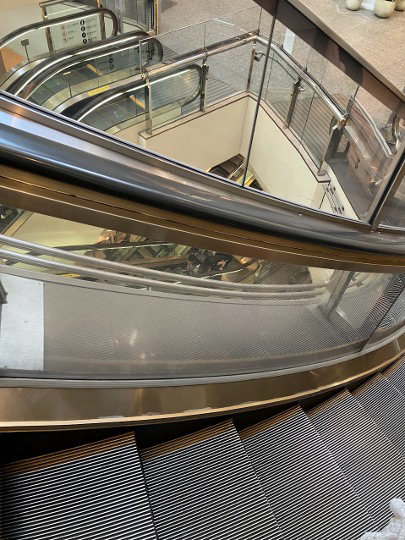

+++
date = '2025-05-15T21:37:51+09:00'
draft = true
title = 'TsukuCTF_SoEG'
+++

# はじめに
東京電機大学 学生CSIRT委員会のビジュアル担当大臣です。  
ただいま緊急で動画を回してるんですけども、なんと今回は 
TsukuCTFのOSINT問題の解説をしていきます。  

# OSINT
## curve

画像で検索するとこちらは三菱電機ビルソリューションズのスパイラルエスカレーターという変わったエスカレーターらしい
このエスカレーターが存在する場所で調べたら横浜ランドマークタワーがそれっぽい
横浜ランドマークタワーのWebサイトのドメインyokohama-landmark.jpをフラグとして終了

# Web
## [問題のタイトル]

# Crypto
## [問題のタイトル]

# Forensics
## [問題のタイトル]

# Reverse
## [問題のタイトル]

# Pwn
## [問題のタイトル]

# Misc
## [問題のタイトル]

# まとめ

# 参考文献
- [Title](url)